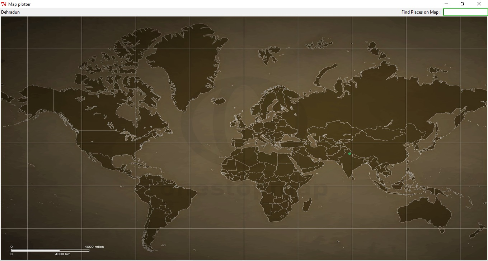

# Map-plot
Python Tkinter GUI application for plotting place on map 
### Requirements
* [Python 2.7](https://www.python.org/download/releases/2.7/)
* [OpenCV 3.0](http://opencv-python-tutroals.readthedocs.org/en/latest/py_tutorials/py_setup/py_setup_in_windows/py_setup_in_windows.html)

### Python Modules Required
* All comes in standard library packages no need to install others

### ScreenShot 

